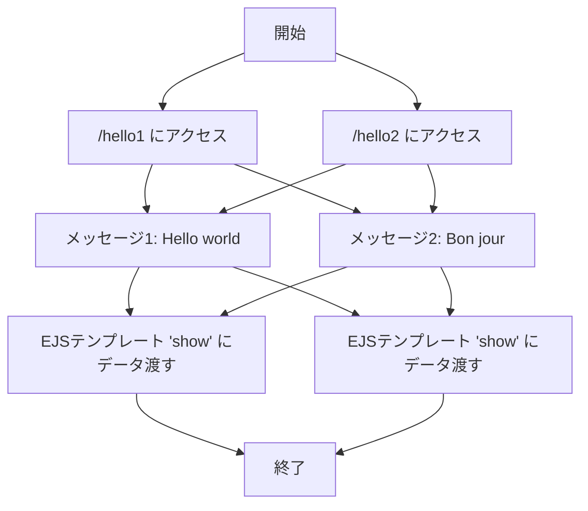
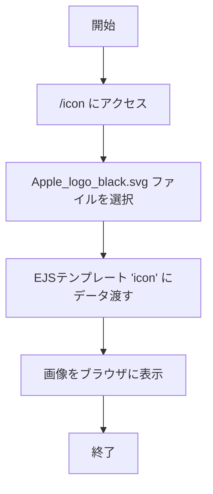
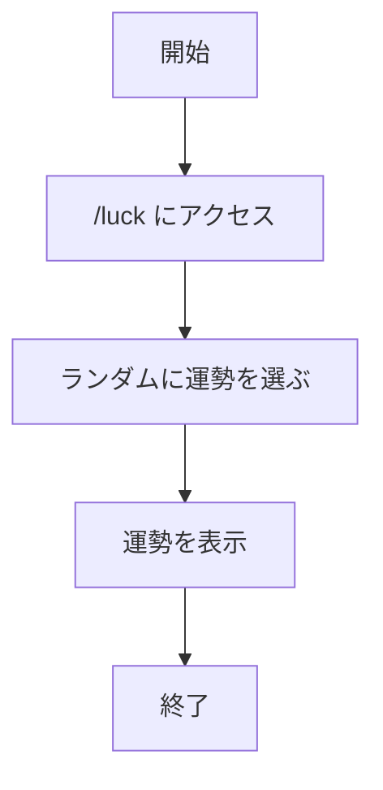
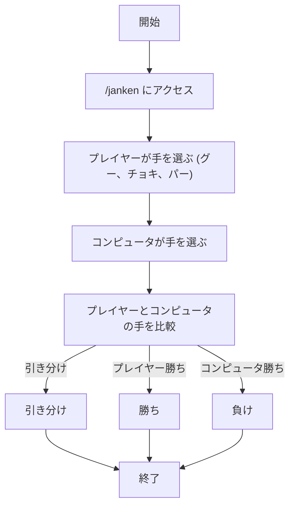
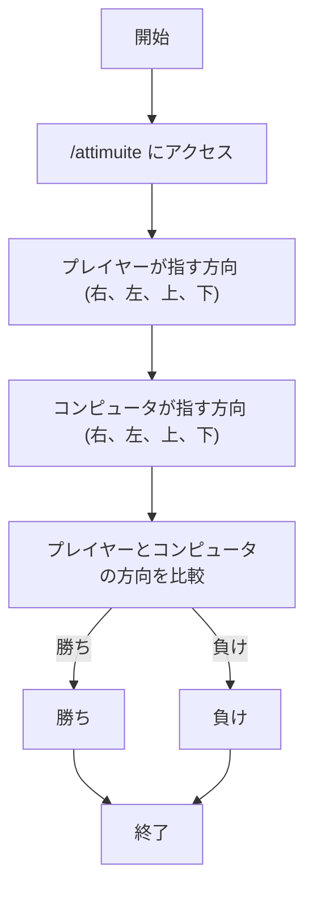
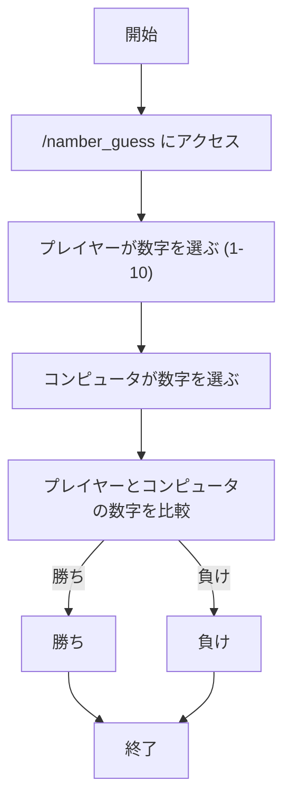

# webpro_06

## このプログラムについて

## ファイル一覧

ファイル名 | 説明
-|-
app5.js | プログラム本体
views/show.ejs | あいさつのテンプレートファイル
views/icon.ejs | アイコンのテンプレートファイル
public/janken.html | じゃんけんの開始画面
views/janken.ejs |　じゃんけんのテンプレートファイル
views/luck.ejs | おみくじのテンプレートファイル
views/attimuite.ejs | あっち向いてホイのテンプレートファイル
views/number-guess.ejs | 数字当てゲームのテンプレートファイル

## 起動方法
1. ターミナルで```node app5.js```を入力しport 8080を起動する
2. ブラウザで```http://localhost:8080/????```を入力しアクセスする.
## hello1 hello2
#### 機能説明
```/hello1``` と ```/hello2``` は,異なる方法で「Hello world」と「Bon jour」のメッセージを表示する.

1. ```/hello1```
2つの変数（message1 と message2）を使用して,メッセージをそれぞれ渡す.
メッセージは Hello world と Bon jour として表示される.
1. ```/hello2```
2つのメッセージをインラインで指定して,テンプレートに渡し,同様のメッセージを表示する.
#### 使用手順
```http://localhost:8080/hello1```または```http://localhost:8080/hello2```にアクセスすると,ブラウザに「Hello world」と「Bon jour」のメッセージが表示される.
メッセージの表示方法が異なるだけで,どちらも同じ内容を出力する.




## icon
#### 機能説明
```/icon``` エンドポイントは,AppleのロゴSVG画像を表示する.

1. ```filename```: ```./public/Apple_logo_black.svg```というファイルパスを指定して,静的ファイルであるAppleのロゴを表示する.
2. ```alt```: 画像に代替テキストとして「Apple Logo」を表示する.
#### 使用手順
```http://localhost:8080//icon``` にアクセスすると,Appleのロゴがブラウザに表示される.
```public``` フォルダにある ```Apple_logo_black.svg``` が表示されるため,事前にファイルを配置しておく必要がある.



## luck
#### 機能説明
```/luck```エンドポイントは,ランダムに運勢を決定し,結果を表示する.

1. ```ランダムな数値を生成```:1から6の間でランダムな数値（num）を生成する.
1: 大吉
2:  中吉
3: 3から6は追加可能  

1.``` 運勢の表示```: 運勢は日本の「おみくじ」の形式で表示され、console.log にも出力される.

#### 使用手順
```http://localhost:8080//luck``` にアクセスすると,ランダムに決まった運勢が表示される.

#### 占いの流れ



##　janken
#### 機能説明
```/janken``` エンドポイントでは,ユーザーが「グー」「チョキ」「パー」のいずれかを選択し,コンピュータとじゃんけんを行う.

1. ```ユーザーの手```: URLのクエリパラメータ hand でユーザーが選んだ手を受ける.
コンピュータの手: ランダムで「グー」「チョキ」「パー」のいずれかを選択する.
1. ```勝敗判定```: ユーザーの手とコンピュータの手を比較し,勝ち,負け,引き分けを判定する.
1. ```勝敗結果の表示```: 判定結果（勝ち,負け,引き分け）と共に、これまでの勝利数（win）や合計回数（total）を表示する.

#### 使用手順
```http://localhost:8080/janken```URLにアクセスしプレイヤーの手（グー、チョキ、パー）とコンピュータの手が表示され,勝敗が判定される,
勝利数や合計プレイ数が反映され,結果が表示される.

#### ジャンケンの流れ


##　attimuite
#### 機能説明
```/attimuite``` エンドポイントは,アッチ向いてホイゲームの結果を判定する.

1. ```ユーザーの選択```: URLのクエリパラメータ direction でユーザーが指した方向（右,左,上,下）を受け取る.
1. ```コンピュータの選択```: ランダムでコンピュータが指す方向（右,左,上,下）を決定する.
1. ```勝敗判定```: ユーザーとコンピュータの指した方向を比較し,勝敗を判定する.
ユーザーが勝った場合,勝利数が増加する.
勝敗が記録され,勝率も計算して表示する.

#### 使用手順
```http://localhost:8080/attimuite```にアクセスし（右,左,上,下）を指定する.
プレイヤーの指した方向とコンピュータの指した方向が表示され,勝敗結果と勝率が反映される.

#### あっち向いてホイの流れ


##　number-guess
#### 機能説明
```/number-guess``` エンドポイントでは,プレイヤーが1から10までの数字を予想し,コンピュータがランダムに選んだ数字と一致するかを判定する.

1. ```プレイヤーの予想```: URLのクエリパラメータ guess でプレイヤーが選んだ数字を受け取りる.
1. ```コンピュータの選択```: 1から10までの数字の中から,ランダムに数字を生成する.
1. ```勝敗判定```: プレイヤーが選んだ数字とコンピュータが選んだ数字を比較し,一致すれば勝ち,一致しなければ負けとなる.
1. ```勝利数と合計回数```: 勝敗の結果に応じて,勝利数と合計回数が更新され,勝率も表示される.

#### 使用手順
```http://localhost:8080/number-guess``` にアクセスし数字を指定する.
プレイヤーが選んだ数字とコンピュータの選んだ数字が表示され,勝敗結果と勝率が反映される.

####　数字当てゲームの流れ


