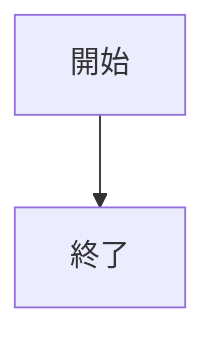
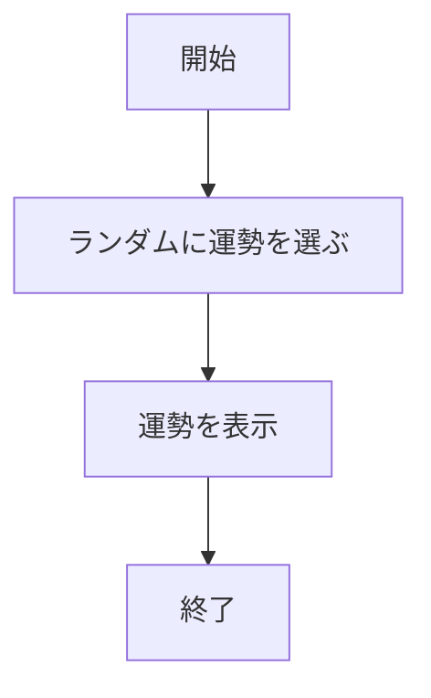
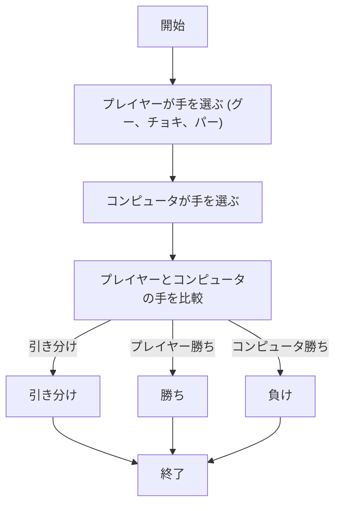
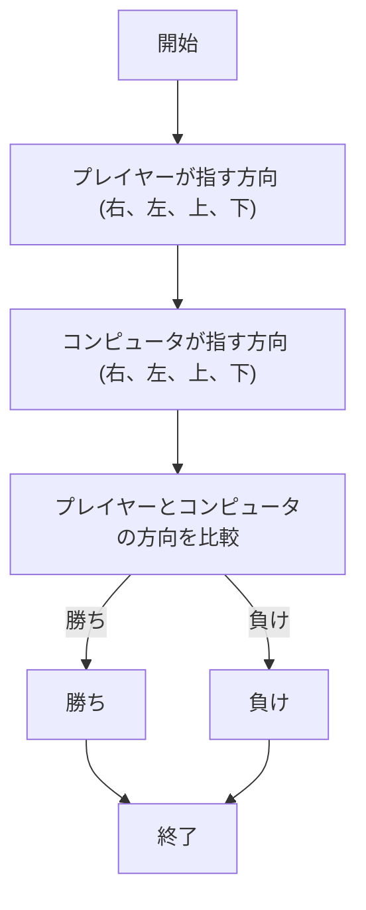
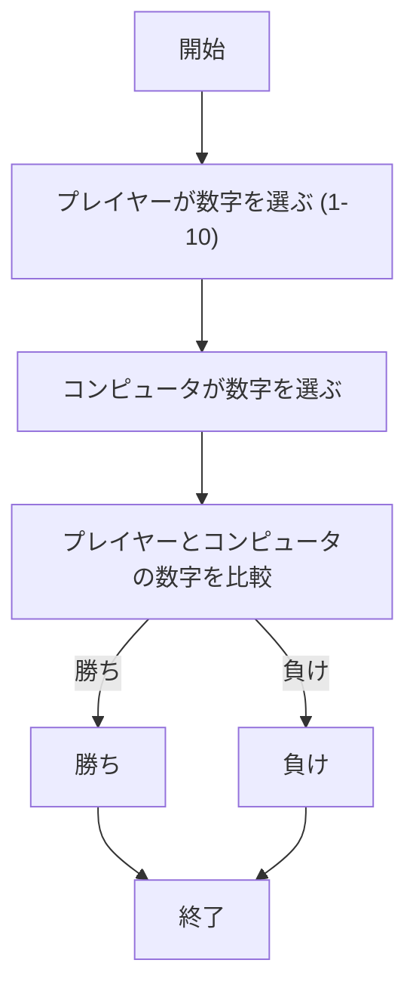

# webpro_06

## このプログラムについて

## ファイル一覧

ファイル名 | 説明
-|-
app5.js | プログラム本体
public/janken.html | じゃんけんの開始画面
views/janken.ejs |　じゃんけんのテンプレートファイル


1. ```app5.js```を起動する
1. Webブラウザで```localhost:8080/public/ janken.html```にアクセスする
1. 自分の手を入力する

/luck
機能説明
/luckエンドポイントは,ランダムに運勢を決定し,結果を表示する機。

ランダムな数値を生成: 1から6の間でランダムな数値（num）を生成します。

1: 大吉
2: 中吉
3-6: それ以外（運勢は設定されていませんが、今後追加することができます）
運勢の表示: 運勢は日本の「おみくじ」の形式で表示され、console.log にも出力されます。

使用手順
/luck にアクセスすると、ランダムに決まった運勢が表示されます（運勢の結果はコンソールにも出力されます）。




###### 占いの流れ


######　ジャンケンの流れ


######　あっち向いてホイの流れ


######　数字当てゲームの流れ


